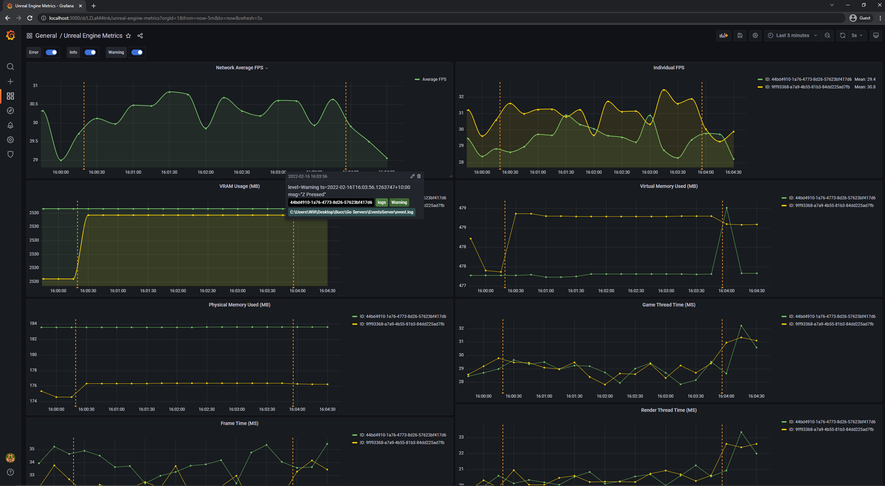
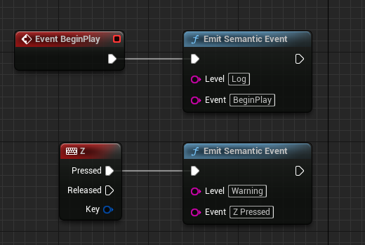

# Buccaneer

<p align="center">
    
</p>


Buccaneer is a solution for the Unreal Engine that logs a variety of performance metrics and semantic events by pushing the collected data to an accompanying part of Go servers. From here, the [Prometheus](https://prometheus.io/) software scrapes the endpoints exposed by the Go server, storing the scraped metrics as it goes. Through the use of a [Grafana](https://grafana.com/) dashboard, the scraped metrics can be seen in an easily interprable manner, with the semantic events being overlayed as annotations.

NOTE: The Buccaneer4PixelStreaming plugin only works in Unreal Engine 5 and is dependant on both the Buccaneer base plugin and the [Pixel Streaming](https://docs.unrealengine.com/4.27/en-US/SharingAndReleasing/PixelStreaming/) plugin.
<br/></br>

# Requirements
* [Prometheus](https://prometheus.io/download/)
* [Grafana](https://grafana.com/grafana/download?platform=windows)
* [Loki and Promtail](https://github.com/grafana/loki/releases)
<br/></br>

# Architecture
The Buccaneer plugin can be split into two primary components:

* ### A Time-Series Data Emitter
The time-series data emitter which collects real-time performance data and exports it for consumption by Prometheus where the per-instance data can then be aggregated in order to examine the performance of an entire multi-instance simulation.

* ### A Semantic Event Emitter
The semantic event emitter facilitates emitting arbitrary and user-defined discrete event information for consumption by [Promtail](https://grafana.com/docs/loki/latest/clients/promtail/). The consumed logs are then displayed as annotations on the Grafana dashboard through the use of [Loki](https://grafana.com/oss/loki/).
<br/></br>

# Using Buccaneer
## Using the Semantic Event Emitter
Interacting with the semantic event emitter can be done with the `Emit Semantic Event` blueprint node 

<p align="center">
    
</p>

or with the `EmitSemanticEvent(FString Level, FString Event)` function. In order to use this function, you must add the `SemanticEventEmitter` to your module dependencies and include `SemanticEventEmitter.h`

<p align="center">
    
</p>

## Configuration
The majority of the configurations provided can be left as-is. However, line 19 of `promtail-local-config.yaml` requires you to configure the path to the log file of the events server. 

### Starting the Go Servers
Both servers can be started by running their respective executables. 

By default, the stats server listens for metric pushes on `localhost:8000`, while the events server listens for events on `localhost:8080`
<br></br>

### Required Launch Arguments
The following launch arguments must be specified when launching an Unreal Engine application that uses Buccaneer:
| Command Line Argument | Description |
| --------------------- | ------------ |
| -StatsEmitterURL=\<value> | Specifies the URL used to push performance metrics to |
| -EventEmitterURL=\<value> | Specifies the URL used to push semantic events to |

<br></br>

### Optional Launch Arguments
The following launch arguments aren't required. However, many applications using Buccaneer may find them useful :
| Command Line Argument | Description |
| --------------------- | ------------ |
| -InstanceID=\<value> | Specifies the ID of the instance. This is used in distinguishing which metrics came from which instance. If the argument is left empty, the ID is generated by the stats server |
| -StatsMetadata=\<values> | Specifies additional metadata for use in distinguishing instances in multi-instance deployments. This is a semi-colon seperated list of key:value pairs. eg "-StatsMetadata=KeyX:ValueX;KeyY:ValueY" |

<br></br>

### Buccaneer Plugin Configuration
The following launch arguments must be specified when launching an Unreal Engine application that uses Buccaneer:
| Command Line Argument | Default Value| Description |
| --------------------- | ------------ |------------ |
| -BuccaneerEnablePerformanceStats=\<true/false> | true | Whether the pushing of performance stats is enabled |
| -BuccaneerEnableEvents=\<true/false> | true | Whether the pushing of semantic events is enabled |
| -Buccaneer4PixelStreamingEnableStats=\<true/false> | true | Whether the pushing of stats collected from pixel streaming is enabled |

<br></br>

A typical application launch is as follows:
```
MyBuccaneerApplication.exe -StatsEmitterURL="127.0.0.1:8000" -EventEmitterURL="127.0.0.1:8080"
```