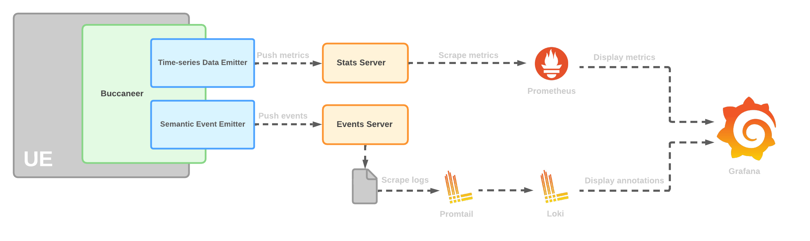

# Buccaneer

<p align="center">
    
</p>

Buccaneer is a solution for the Unreal Engine that logs a variety of performance metrics and semantic events by pushing the collected data to an accompanying part of Go servers. From here, the [Prometheus](https://prometheus.io/) software scrapes the endpoints exposed by the Go server, storing the scraped metrics as it goes. Through the use of a [Grafana](https://grafana.com/) dashboard, the scraped metrics can be seen in an easily interprable manner, with the semantic events being overlayed as annotations.

NOTE: The Buccaneer4PixelStreaming plugin only works in Unreal Engine 5 and is dependant on both the Buccaneer base plugin and the [Pixel Streaming](https://docs.unrealengine.com/4.27/en-US/SharingAndReleasing/PixelStreaming/) plugin.
<br/></br>


## Requirements

- [Prometheus](https://prometheus.io/download/)
- [Grafana](https://grafana.com/grafana/download?platform=windows)
- [Loki and Promtail](https://github.com/grafana/loki/releases)
<br/></br>


## Architecture

The Buccaneer plugin consists of two primary components:

- **Time-Series Data Emitter**
    
    The time-series data emitter collects real-time performance data and exports it for consumption by Prometheus where the per-instance data can then be aggregated in order to examine the performance of an entire multi-instance simulation.

- **Semantic Event Emitter**
    
    The semantic event emitter facilitates emitting arbitrary and user-defined discrete event information for consumption by [Promtail](https://grafana.com/docs/loki/latest/clients/promtail/). The consumed logs are then displayed as annotations on the Grafana dashboard through the use of [Loki](https://grafana.com/oss/loki/).

<p align="center">
    
</p>

<br/></br>


## Using Buccaneer

### How do I use these custom plugins in my Unreal Project?

- Adding to your project
    
    - Navigate to your project folder which contains [ProjectName].uproject
    
    - Copy the `Plugins` folder to this directory
    
<br></br>

### Using the Semantic Event Emitter

Interacting with the semantic event emitter can be done with the `Emit Semantic Event` blueprint node 

<p align="center">
    
</p>

or with the `EmitSemanticEvent(FString Level, FString Event)` function. In order to use this function, you must add the `SemanticEventEmitter` to your module dependencies and include `SemanticEventEmitter.h`

<p align="center">
    
</p>

### Configuration

The majority of the configurations provided can be left as-is. However, [Line 19 of `promtail-local-config.yaml`](https://github.com/Belchy06/Buccaneer/blob/48aff076edbfad76fe349c0de4d85e52f7b3d0c2/Configs/promtail-local-config.yaml#L19) requires you to configure the path to the log file of the events server. 

#### Starting the Buccaneer Server

The Buccaneer server can be started by running its executable located under `/Build` or by running `go run ./main.go` from the `Server/BuccaneerServer` directory. 

By default, the server listens for metric and event pushes on `127.0.0.1:8000`
<br></br>

#### Required Launch Arguments

The following launch arguments must be specified when launching an Unreal Engine application that uses Buccaneer:
| Command Line Argument | Description |
| --------------------- | ------------ |
| -BuccaneerURL=\<value> | Specifies the URL used to push performance metrics and semantic events to |

<br></br>

#### Optional Launch Arguments

The following launch arguments aren't required. However, many applications using Buccaneer may find them useful:
| Command Line Argument | Description |
| --------------------- | ------------ |
| -BuccaneerID=\<value> | Specifies the ID of the instance. This is used in distinguishing which metrics came from which instance. If the argument is left empty, the ID is generated by the stats server |
| -BuccaneerMetadata=\<values> | Specifies additional metadata for use in distinguishing instances in multi-instance deployments. This is a semi-colon separated list of key:value pairs. eg "-BuccaneerMetadata=KeyX:ValueX;KeyY:ValueY" |

<br></br>

#### Buccaneer Plugin Configuration

The following launch arguments must be specified when launching an Unreal Engine application that uses Buccaneer:
| Command Line Argument | Default Value| Description |
| --------------------- | ------------ |------------ |
| -BuccaneerEnableStats=\<true/false> | true | Whether the pushing of performance stats is enabled |
| -BuccaneerEnableEvents=\<true/false> | true | Whether the pushing of semantic events is enabled |
| -Buccaneer4PixelStreamingEnableStats=\<true/false> | true | Whether the pushing of stats collected from pixel streaming is enabled |

<br></br>

#### Buccaneer Runtime Configuration

The following CVars can be used to toggle on and off aspects of Buccaneer at runtime:
| Command Line Argument | Default Value| Description |
| --------------------- | ------------ |------------ |
| Buccaneer.EnableStats=\<1/0> | 1 | Whether the pushing of performance stats is enabled |
| Buccaneer.EnableEvents=\<1/0> | 1 | Whether the pushing of semantic events is enabled |

<br></br>

A typical application launch is as follows:
```
MyBuccaneerApplication.exe -BuccaneerURL="127.0.0.1:8000"
```


## Running the Docker Compose demo

To try Buccaneer with a demo project, you can use the Docker Compose demo located in the [Examples](./Examples) subdirectory. The demo has the following requirements:

- One of the Linux distributions that is [supported by the NVIDIA Container Toolkit](https://docs.nvidia.com/datacenter/cloud-native/container-toolkit/install-guide.html#supported-platforms)

- The proprietary NVIDIA GPU drivers

- [Docker](https://www.docker.com/)

- [NVIDIA Container Toolkit](https://docs.nvidia.com/datacenter/cloud-native/container-toolkit/overview.html)

To start the demo, simply run the command `docker compose up` in the [Examples/Compose](./Examples/Compose) subdirectory. Docker Compose will automatically download all of the required container images and start the containers for each component of the stack. Once everything is running, open two web browser tabs:

- <http://127.0.0.1> - this is a demo Unreal Engine application that uses Pixel Streaming to allow streaming via a browser.

- <http://127.0.0.1:3000/dashboards> - this is the Grafana dashboard that displays metrics collected from the Unreal Engine application. Login using the username `admin` and the password `admin`, and select "Unreal Engine Metrics" from the list of available dashboards.


## Legal

Copyright &copy; 2021-2022, TensorWorks Pty Ltd. Licensed under the MIT License, see the file [LICENSE](./LICENSE) for details.
